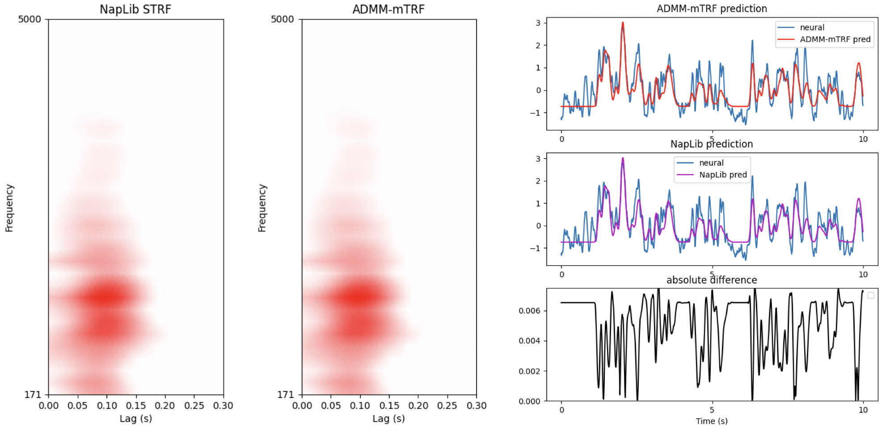

## multivariate temporal response function (mTRF) model with elastic net regularization
The encoding mTRF model describes how the system generates or encodes information.
Let $r(t)$ denote the neural response sampled at time $t=1,\cdots,T$, and $s(t)$ be the stimulus.
We want to find the channel specific temporal response function $w(t)$, such that

$$r(t) = \sum_{\tau} w(\tau) s(t-\tau) + \epsilon (t),$$

where $\epsilon(t)$ is the residual not explained by the model. In matrix form we write

$$\mathbf{r}= \mathbf{S} \mathbf{w}+ \boldsymbol{\epsilon}.$$

Elastic net regularization combines the principles of Ridge ($\ell_2$) and Lasso
($\ell_1$; which penalizes the absolute value of the coefficients) to enforce
both small and sparse TRFs. The mTRF estimation problem with elastic net
regularization is written as

$$\mathbf{w}^\ast = \arg\min_{\mathbf{w}} \frac{1}{2}||\mathbf{r} - \mathbf{S}\mathbf{w}||_2^2 + \frac{\alpha (1-\lambda)}{2} ||\mathbf{w}||_2^2 + \alpha\lambda ||\mathbf{w}||_1,$$

where $\alpha$ is the elastic net regularization parameter, and
$\lambda\in(0,1)$ controls the ratio of penalizing the $\ell_2$ and $\ell_1$
terms. The problem in \eqref{Eq:mtrf_elastic} does not have a closed form
solution, however, we can find the minimizer using iterative methods. We propose
to solve this minimization problem using the alternating direction method of
multipliers (ADMM).

## example usage
Here is a simple example on how to use the solver:

```python
from ADMM_mTRF import admm_mTRF
# set you data
x_train = [...]
y_train = [...]
sfreq = 100 # in Hz
tmin  = 0.0 # in sec
tmax  = 0.3 # in sec
admm_mtrf = admm_mTRF(direction=1)
admm_mtrf.train(x_train, y_train,
                   sfreq, tmin, tmax,
                   alpha=1.0,
                   l1_ratio=0.01)
trfs = admm_mtrf.weights
```

## fast implementation for multi-sensor measurments
We compare our implementation to the example provided by `NapLib` [here](https://naplib-python.readthedocs.io/en/latest/auto_examples/strf_fitting/plot_STRF_fitting_basics.html). The `NapLib` library fits the mTRF model separately for each sensor and uses the generic solver from scikit-learn for elastic net regularization.

We show that

| Model Name | Training Time (sec) |
|------------|---------------------|
| ADMM-mTRF  |   3.60 $\pm$ 0.16   |
| NapLib     |  95.63 $\pm$ 2.31   |




